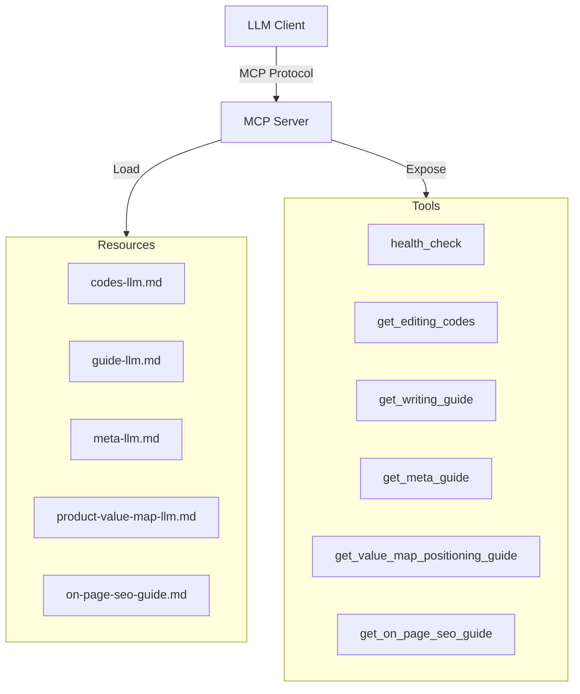
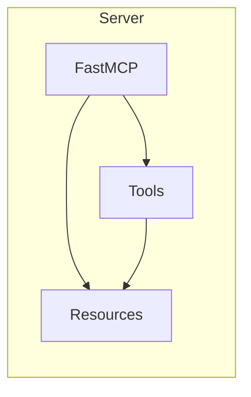
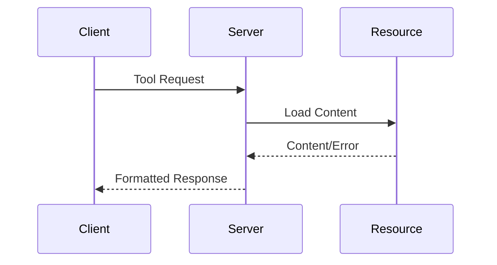

# System Patterns: OSP Marketing Tools

## Architecture Overview



## Key Technical Decisions

### 1. MCP Server Implementation
- Using FastMCP framework for server implementation
- Asynchronous request handling with Python asyncio
- Tool-based architecture exposing specific functionalities
- Resource files stored as markdown for maintainability

### 2. Project Structure
```
src/osp_marketing_tools/
├── __init__.py
├── server.py              # MCP server implementation
├── codes-llm.md          # Editing codes resource
├── guide-llm.md          # Writing guide resource
├── meta-llm.md           # Meta information guide
├── product-value-map-llm.md  # Value map guide
└── on-page-seo-guide.md  # SEO optimization guide
```

### 3. Design Patterns

#### Resource Loading Pattern
- Resources stored as markdown files
- Dynamic loading based on tool requests
- Error handling for missing resources
- Consistent response structure

```python
{
    "success": bool,
    "data": {
        "content": str
    } | None,
    "error": str | None
}
```

#### Tool Implementation Pattern
- Decorator-based tool registration
- Async function implementation
- Clear documentation strings
- Consistent error handling

```python
@mcp.tool()
async def tool_name() -> dict:
    """Tool documentation."""
    try:
        # Implementation
        return {"success": True, "data": {...}}
    except FileNotFoundError:
        return {"success": False, "error": "..."}
```

### 4. Error Handling Strategy
- Graceful handling of missing resources
- Clear error messages
- Consistent error response format
- Exception catching in main server loop

### 5. Logging and Monitoring
- Structured logging implementation
- Named logger per module
- Health check endpoint
- Version tracking

## Component Relationships

### 1. Server Components


### 2. Tool Flow Pattern


## Technical Constraints

### 1. Resource Management
- All resource files must be markdown format
- Resources must be in same directory as server
- File paths are relative to script location

### 2. Response Format
- All tools must return dictionary responses
- Success status must be boolean
- Error messages must be descriptive

### 3. Performance
- Async implementation required
- Resource caching recommended
- Memory efficient file handling

## Extension Points

### 1. New Tools
- Use @mcp.tool() decorator
- Follow existing response pattern
- Include proper documentation
- Implement error handling

### 2. New Resources
- Add markdown file to package
- Create corresponding tool
- Update documentation
- Follow naming convention

### 3. Configuration
- Environment variable support
- Custom resource paths
- Logging configuration
- Server parameters

## Development Guidelines

### 1. Code Style
- Follow Python async patterns
- Use type hints
- Include docstrings
- Handle exceptions

### 2. Resource Updates
- Maintain markdown formatting
- Update version numbers
- Document changes
- Test content loading

### 3. Testing Strategy
- Unit tests for tools
- Resource availability checks
- Error case testing
- Integration testing
